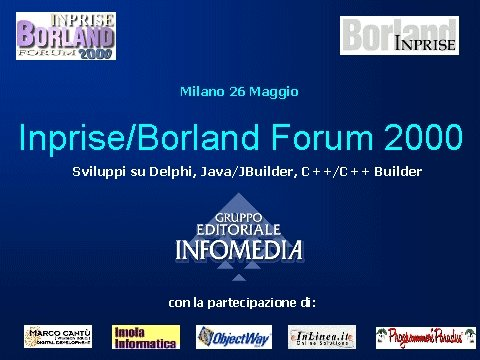
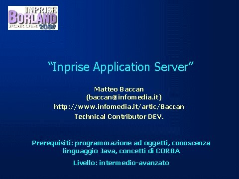
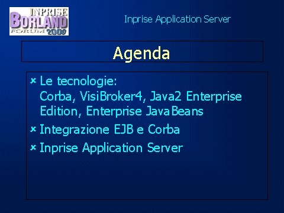
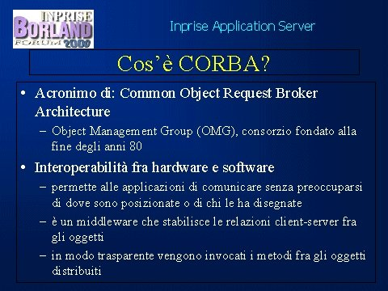
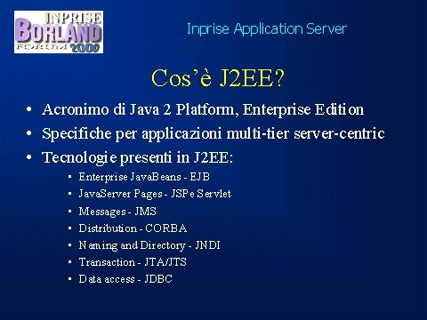
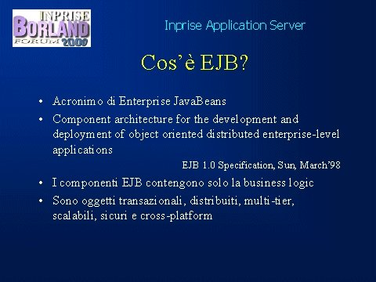
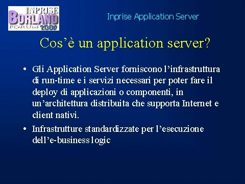
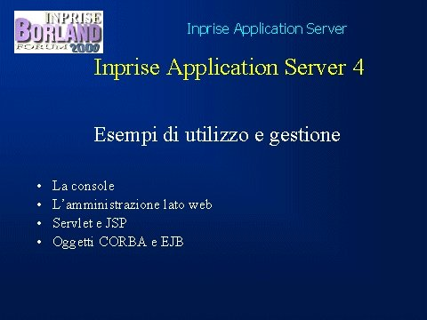
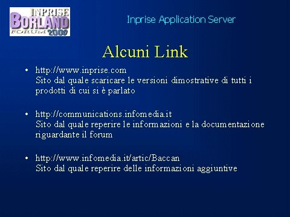

# Inprise/Borland Forum 2000

Materiale del mio intervento all'**Inprise/Borland Forum 2000**, l'incontro annuale degli sviluppatori Borland/Inprise tenutosi a **Milano il 26 maggio 2000**.

## La presentazione

**Titolo:** Inprise Application Server

**Relatore:** Matteo Baccan — Technical Contributor DEV, Infomedia

**Prerequisiti:** programmazione ad oggetti, linguaggio Java, concetti di CORBA

**Livello:** intermedio-avanzato

### Argomenti trattati

- **Le tecnologie di base**
  - CORBA — Common Object Request Broker Architecture
  - VisiBroker 4
  - Java 2 Enterprise Edition (J2EE)
  - Enterprise JavaBeans (EJB)

- **J2EE e il suo ecosistema**
  - Enterprise JavaBeans (EJB)
  - JavaServer Pages (JSP) e Servlet
  - Messaging (JMS)
  - Distribution (CORBA)
  - Naming and Directory (JNDI)
  - Transaction (JTA/JTS)
  - Data access (JDBC)

- **Integrazione EJB e CORBA**

- **Inprise Application Server 4**
  - La console di amministrazione
  - L'amministrazione lato web
  - Servlet e JSP
  - Oggetti CORBA e EJB

## L'evento

L'**Inprise/Borland Forum 2000** era l'appuntamento annuale dedicato agli sviluppatori che utilizzavano i prodotti Borland/Inprise: Delphi, Java/JBuilder, C++/C++ Builder.

L'evento era organizzato dal **Gruppo Editoriale Infomedia** con la partecipazione di: Marco Cantù, Imola Informatica, ObjectWay, InLinea.it, Programmer's Paradise.

## Slide

| | | |
|---|---|---|
|  |  |  |
|  |  |  |
|  |  |  |

## Autore

**Matteo Baccan** — sviluppatore software, formatore e divulgatore tecnico.

- GitHub: [github.com/matteobaccan](https://github.com/matteobaccan)

## Licenza

Questo repository contiene materiale storico di archivio personale.
